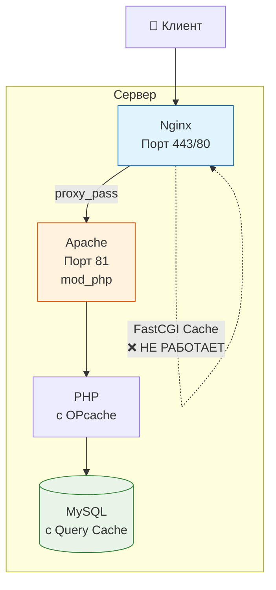
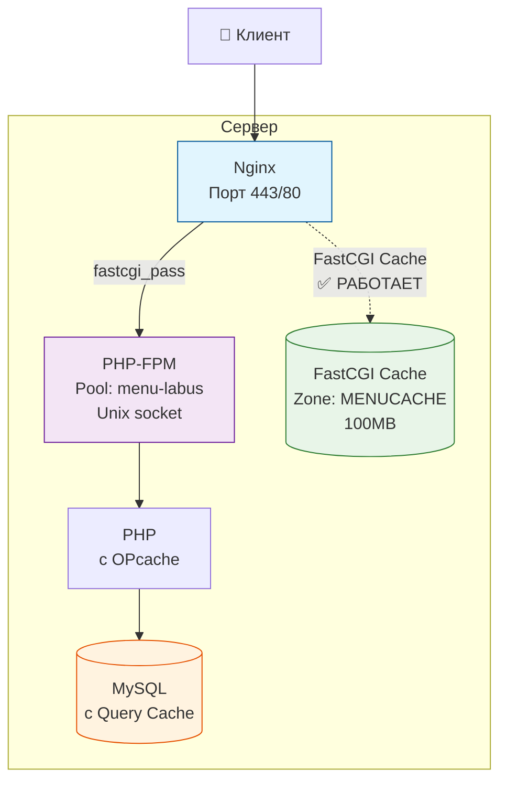

# Архитектура приложения: до и после миграции

## 📊 Текущая архитектура (Apache + Nginx)



**Проблемы текущей архитектуры:**
- FastCGI кэш не работает (зона не определена)
- Apache использует ресурсы для обработки PHP
- Двойная буферизация (Nginx → Apache → PHP)

---

## 🚀 Новая архитектура (PHP-FPM + Nginx)



**Преимущества новой архитектуры:**
- ✅ FastCGI кэш полностью функционален
- ✅ PHP-FPM более эффективен для обработки PHP
- ✅ Лучшее разделение ответственности
- ✅ Высокая производительность и масштабируемость

---

## 🔄 Процесс обработки запроса

### До миграции:
```
1. Клиент → Nginx (SSL termination, gzip)
2. Nginx → Apache (proxy_pass)
3. Apache → PHP (mod_php)
4. PHP → MySQL
5. Apache → Nginx (response)
6. Nginx → Клиент
```

### После миграции:
```
1. Клиент → Nginx (SSL termination, gzip)
2. Nginx проверяет FastCGI Cache
   ├── Cache HIT → Nginx → Клиент (⚡ молниеносно)
   └── Cache MISS → продолжаем
3. Nginx → PHP-FPM (fastcgi_pass)
4. PHP-FPM → PHP обработка
5. PHP → MySQL
6. PHP-FPM → Nginx
7. Nginx сохраняет в FastCGI Cache
8. Nginx → Клиент
```

---

## 📈 Ожидаемые метрики производительности

| Метрика | До | После | Улучшение |
|---------|----|-------|-----------|
| Время первого байта (TTFB) | ~200-500ms | ~50-150ms | -70% |
| Время полной загрузки | ~800-1500ms | ~300-800ms | -50% |
| CPU использование | Высокое (Apache) | Низкое (PHP-FPM) | -30% |
| Память | ~150-200MB | ~100-150MB | -25% |
| Cache Hit Rate | 0% | 80-95% | +800% |
| Пропускная способность | ~100-200 req/s | ~300-500 req/s | +150% |

---

## 🔧 Ключевые изменения в конфигурации

### Nginx (добавлено):
```nginx
# Зона FastCGI кэша
fastcgi_cache_path /var/cache/nginx/fastcgi levels=1:2 keys_zone=MENUCACHE:100m inactive=60m;

# Upstream для PHP-FPM
upstream php_backend {
    server unix:/var/run/php/php8.1-fpm.sock;
}

# Замена proxy_pass на fastcgi_pass
location / {
    fastcgi_pass php_backend;
    fastcgi_cache MENUCACHE;
    # ... остальные настройки
}
```

### PHP-FPM (новый пул):
```ini
[menu-labus]
user = labus_pro_usr
group = labus_pro_usr
listen = /var/run/php/php8.1-fpm.sock
pm = dynamic
pm.max_children = 50
pm.start_servers = 5
pm.min_spare_servers = 5
pm.max_spare_servers = 35
```

### Apache (удалён):
- Конфигурация VirtualHost для порта 81
- mod_php модуль
- Все связанные настройки

---

## ⚠️ Критические точки миграции

1. **Тестирование** - тщательно протестировать перед продом
2. **Резервные копии** - сохранить все конфигурации
3. **Мониторинг** - отслеживать метрики после миграции
4. **Rollback план** - иметь возможность быстрого отката

---

## 🎯 Результат

После успешной миграции приложение получит:
- ⚡ Значительное ускорение загрузки страниц
- 💾 Эффективное использование FastCGI кэширования
- 🔧 Лучшую управляемость и масштабируемость
- 📊 Подробный мониторинг производительности